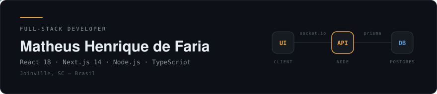

  

  &nbsp;
  &nbsp;
  &nbsp;
  

---

### Sobre

Desenvolvedor Full-Stack com **mais de 4 anos** construindo aplicações web escaláveis e de alta
performance. Trabalho no ecossistema **JavaScript/TypeScript** com foco em **React.js, Next.js e
Node.js** — arquitetura de APIs RESTful, comunicação em tempo real com WebSockets/Socket.io,
conteinerização com Docker, integração de sistemas e automação de workflows.

Perfil orientado a resultado: Clean Code, boas práticas de engenharia e entrega contínua em squads ágeis.

 

### Stack principal

  
  
  
  
  
  
  
  
  
  

<b>Stack completa</b>

 

| | |
|---|---|
| **Linguagens** | TypeScript · JavaScript (ES6+) · PHP 8+ · C# · SQL |
| **Front-end** | React.js 18 · Next.js 14 (App Router, SSR/SSG/ISR) · Vue.js 3 (Composition API) · Tailwind CSS · Shadcn/UI · Vuetify · Zustand · Redux Toolkit |
| **Back-end** | Node.js · Express · Fastify · Bun · Laravel 10+ · REST API · WebSockets · Socket.io · JWT · OAuth2 |
| **Bancos de dados** | PostgreSQL · MySQL · SQL Server · Prisma ORM · Dapper · Eloquent ORM |
| **DevOps / Infra** | Docker · Docker Compose · Git · GitHub Actions (CI/CD) · Vercel · Linux · Nginx · PM2 |
| **Automação** | n8n · Webhooks · APIs de terceiros (WhatsApp Business, Outlook, ERPs) · Cron Jobs |
| **Arquitetura** | APIs RESTful · Clean Code · Design Patterns (Repository, Strategy, Observer) · MVC · Layered Architecture |
| **Metodologias** | Scrum · Kanban · Git Flow · Code Review |

 

### O que eu faço

- **APIs RESTful escaláveis** com Node.js + TypeScript, Prisma ORM e modelagem relacional avançada.
- **SQL de verdade** — stored procedures, triggers, views materializadas, CTEs, índices parciais e tuning via `EXPLAIN ANALYZE` em PostgreSQL e SQL Server.
- **Tempo real** com Socket.io e WebSockets para dashboards industriais e dispositivos IoT.
- **Front-end performático** com React 18 e Next.js 14 — SSR, ISR e React Server Components para Core Web Vitals e SEO.
- **Automação de workflows** com n8n, integrando WhatsApp Business API, Microsoft Outlook e ERPs via webhooks.
- **Auth e segurança** — JWT com access/refresh tokens, fluxos OAuth2 e controle granular de permissões por roles.
- **Conteinerização** com Docker e Docker Compose, padronizando deploys entre ambientes.

 

### Experiência

<table>
<tr><td><b>Analista de Sistemas — Full-Stack</b> Grupo Alltech</td><td>Jun 2025 — Presente</td></tr>
<tr><td><b>Analista de Sistemas — Full-Stack</b> NCAM</td><td>Jan 2025 — Mai 2025</td></tr>
<tr><td><b>Analista de Desenvolvimento de Sistemas</b> Consulth Soluções Empresariais</td><td>Abr 2024 — Jan 2025</td></tr>
<tr><td><b>Analista de Desenvolvimento de Sistemas</b> Schulze Recuperação de Crédito</td><td>Jul 2022 — Abr 2024</td></tr>
</table>

<b>Formação e certificações</b>

 

**Formação**
- Bacharelado em Engenharia de Software — UniCesumar · Jul 2023 — Jul 2026
- Bacharelado — Univille · concluído em 2017
- Técnico em Informática — SENAI · Jan 2015 — Dez 2016

**Cursos complementares**
- Summit de Inteligência Artificial 2025 — 20h
- Prisma ORM: O ORM Moderno para Node.js — 5h
- TypeScript: Do Zero ao Avançado — 8h
- React.js / Next.js Completo — 24.5h
- Docker Completo — 5.5h
- Formação Node.js — 50h

**Idiomas** — Inglês intermediário (leitura técnica e comunicação) · Espanhol elementar

 

---

Aberto a conversas sobre arquitetura, performance e sistemas em tempo real.

